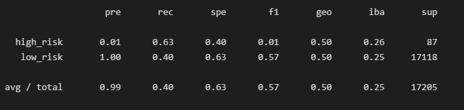

# Credit_Risk_Analysis

Credit risk is an inherently unbalanced classification problem, as good loans easily outnumber risky loans. Therefore, we will need to employ different techniques to train and evaluate models with unbalanced classes. We will be utilizing `imbalanced-learn` and `scikit-learn` libraries to build and evaluate models using resampling.

## Overview

Using the credit card credit dataset from LendingClub, a peer-to-peer lending services company, we will oversample the data using the `RandomOverSampler` and `SMOTE` algorithms, and undersample the data using the `ClusterCentroids` algorithm. Then, utilizing a combination approach of over- and undersampling using the `SMOTEENN` algorithm. Next, we will compare two new machine learning models that reduce bias, `BalancedRandomForestClassifier` and `EasyEnsembleClassifier`, to predict credit risk. We will then evaluate the performance of these models and make a written recommendation on whether they should be used to predict credit risk.

## Results

The original dataset contained 115,675 loan applications in Q1 of 2019. We used the "loan status" to determine whether the application was considered "low" or "high" risk. Applications that had "current" as the "loan status" were classified as "low risk" and the remaining as "high risk". This reduced the dataset to 68,817 total applications with 99% classified as "low risk".

### Naive Random Oversampling

* Balanced Accuracy: 0.6441162962157196

* Precision: The precision is low for High-risk loans and is high for Low-risk loans.
* Recall: High/Low risk = .62/.67

### SMOTE Oversampling

* Balanced Accuracy: 0.6482720346801714

* Precision: The precision is low for High-risk loans and is high for Low-risk loans.
* Recall: High/Low risk = .64/.66

### Undersampling

* Balanced Accuracy: 0.517312891048342

* Precision: The precision is low for High-risk loans and is high for Low-risk loans.
* Recall: High/Low risk = .63/.40

### Combination Under-Over Sampling

* Balanced Accuracy: 0.6362167671859829

* Precision: The precision is low for High-risk loans and is high for Low-risk loans.
* Recall: High/Low risk = .69/.58

### Balanced Random Forest Classifier

* Balanced Accuracy: 0.7885466545953005

* Precision: The precision is low for High-risk loans and is high for Low-risk loans.
* Recall: High/Low risk = .70/.87

### Easy Ensemble Adaboost Classifier

* Balanced Accuracy: 0.9316600714093861

* Precision: The precision is low for High-risk loans and is high for Low-risk loans.
* Recall: High/Low risk = .92/.94

## Summary

When working with balanced accuracy, the highest compared accuracy between 0 and 1 and is closest to 1 is the best machine learning model. For the credit card data set, the Easy Ensemble AdaBoost Classifier is the best model to choose with its .93 balanced accuracy. The other models were below .80 balanced accuracy. The precision for all models were similar and within an appropriate range. The recall score also needs to fall within 0 and 1, with numbers closer to 1 being the better model. The Easy Ensemble AdaBoost Classifier had the highest recall score, making it the final best machine learning model to choose for further credit card analysis.